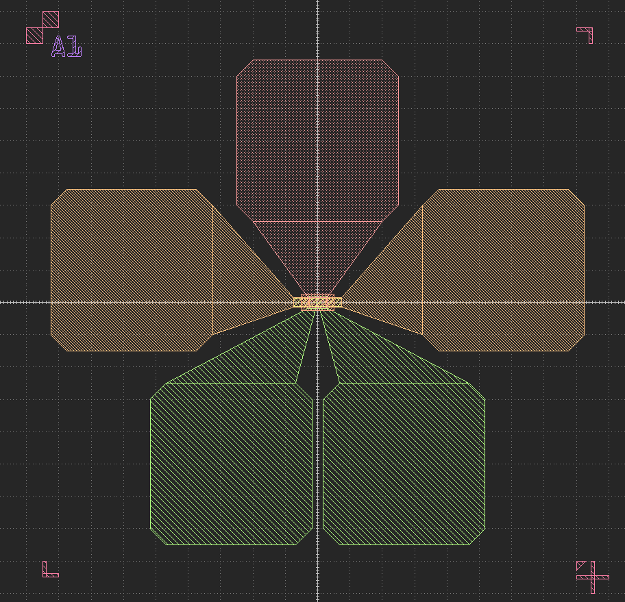
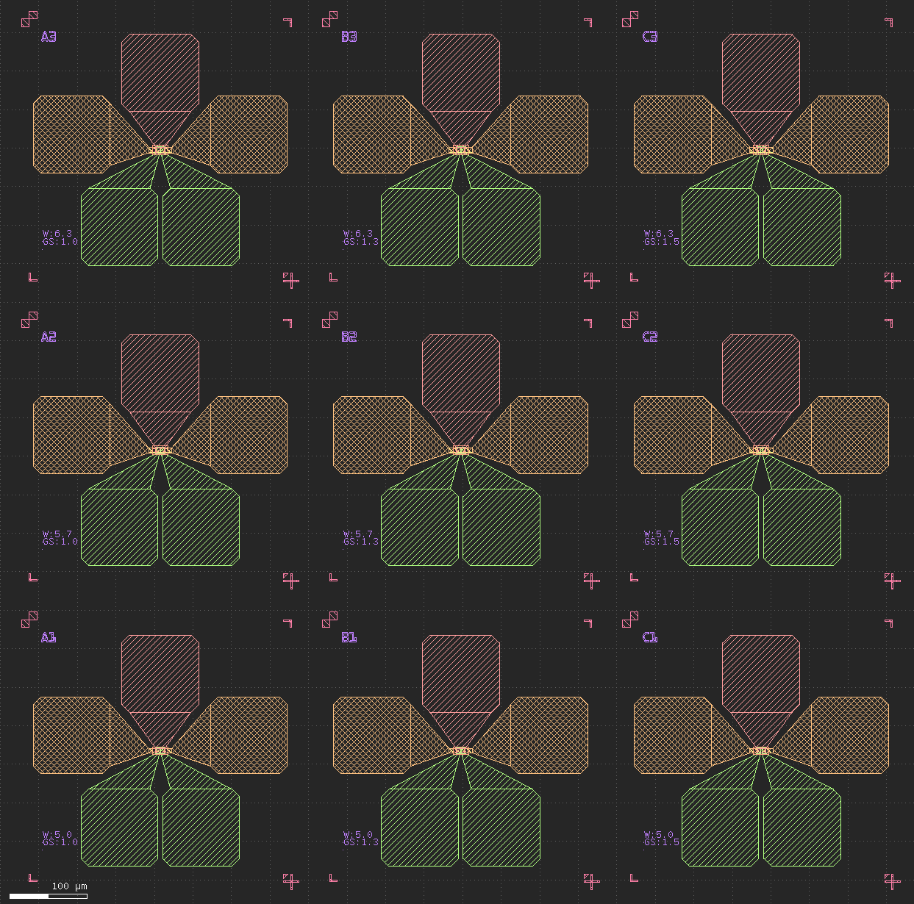

# KLayout  Nano-device Layout  Toolkit

[](https://www.python.org/downloads/)
[](https://www.klayout.de/)
[](LICENSE)

<p align="center">
  
</p>


<h1 align="center">KLayout Nanodevice Toolkit</h1>
<p align="center">
  A modular, professional Python toolkit for rapid semiconductor device layout generation in KLayout.
</p>

---

## Overview

KLayout Nanodevice Toolkit provides a clean, extensible framework for generating parameterized device layouts, custom electrodes, advanced fanout, alignment marks, and more. All core logic is implemented in Python modules for easy customization and scripting, with KLayout macro (.lym) interfaces for GUI-based workflows.

---

## Installation

1. **Clone the repository**
   ```bash
   git clone <your-repo-url>
   cd KLayout_Nanodevice_Toolkit
   ```

2. **Install Python dependencies**
   ```bash
   pip install -r requirements.txt
   ```

3. **Test device generation**
   - You can directly run or modify scripts in the `components/` directory, or write your own scripts to call functions from `utils/`.

---

## Utilities Overview (`utils/`)

- **geometry.py**: Core geometric primitives, shape operations, transformations, boolean ops.
- **fanout_utils.py**: Automated fanout routing, pad array generation, connection logic.
- **mark_utils.py**: Alignment, measurement, and custom mark generation.
- **text_utils.py**: Multi-language text label rendering and placement.
- **digital_utils.py**: Digital device pattern utilities.
- **QRcode_utils.py**: QR code generation and layout embedding.

---

## Device Components (`components/`)

Each script generates a typical device structure. Example usage:

- **fet.py**: Field-Effect Transistor (FET) generator
- **hallbar.py**: Hall bar device generator
- **tlm.py**: Transfer Length Method (TLM) structure generator
- **electrode.py**: Custom electrode and pad generator
- **resolution.py**: Resolution test patterns

---

## Usage Examples

### 1. Single Device Creation (Python API)

```python
from components.fet import FET

fet = FET(
    x=0, y=0,
    channel_width=5.0,
    channel_length=20.0,
    gate_overlap=2.0,
    device_label="FET_1"
)
fet.generate()
```

### 2. Parameter Scan Array Creation (Python API)

```python
from layout_generator import LayoutGenerator

gen = LayoutGenerator()
gen.set_array_config(rows=3, cols=3, spacing_x=100, spacing_y=100)
gen.set_scan_config(
    channel_width_range=[2, 4, 6],
    channel_length_range=[10, 20, 30],
    scan_type='grid'
)
gen.generate_layout()
gen.save_layout("device_array.gds")
```

---

## KLayout Macro Usage (`lymtoolkit/`)

### 1. Single Device via Macro (GUI)

- Install macros as described above.
- In KLayout, go to **Tools → Macros → Run Macro...** or use the menu entry for the installed macro (e.g., `fet_pcell` or similar in `lymtoolkit/nanodevice-pcell/`).
- A dialog will appear for you to input device parameters (e.g., channel width, length, overlap, label).
- Click OK to place the device in your layout.

<p align="center">
  
</p>
<p align="center"><em>Example: Single device created using lym macro in KLayout</em></p>

### 2. Parameter Scan Array via Macro (GUI)

- In KLayout, select the macro for array/parameter scan (e.g., `fanout_pcell` or a dedicated array macro in `lymtoolkit/nanodevice-pcell/`).
- Enter the array configuration (rows, columns, spacing) and parameter sweep ranges in the dialog.
- Confirm to automatically generate the full device array in the layout.

<p align="center">
  
</p>
<p align="center"><em>Example: Parameter scan array created using lym macro in KLayout</em></p>

> **Note:** If the above images do not display, please add your screenshots as <code>lymtoolkit/example_single_device.png</code> and <code>lymtoolkit/example_array.png</code> in the repository.

> **Note:** The .lym macros provide a user-friendly GUI for device and array creation, internally calling the same Python logic as the API examples above. For advanced customization, edit or extend the Python modules in `components/` and `utils/`.

---

## License

MIT License. See [LICENSE](LICENSE) for details.

---

Built on [KLayout](https://www.klayout.de/). Inspired by the open-source EDA community. 