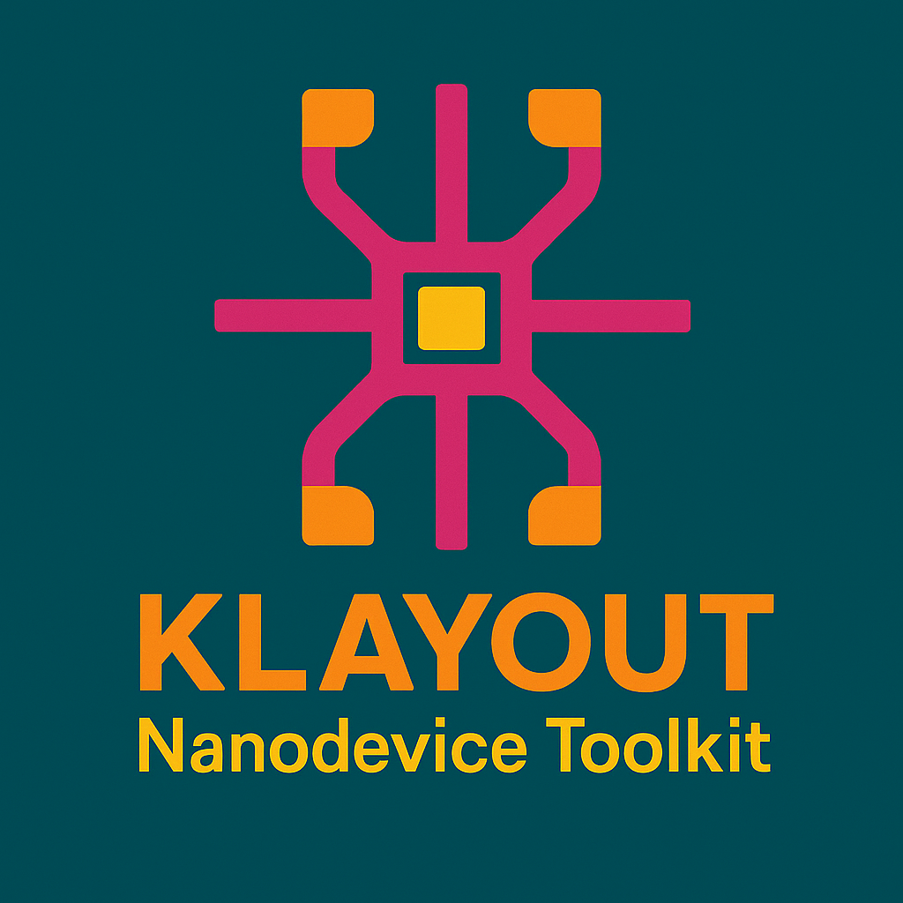

# KLayout 纳米器件版图工具包

[](https://www.python.org/downloads/)
[](https://www.klayout.de/)
[](LICENSE)

<p align="center">
  
</p>

<h1 align="center">KLayout Nanodevice Toolkit</h1>
<p align="center">
  一个模块化、专业的 Python 工具包，用于在 KLayout 中快速生成半导体器件版图。
</p>

---

## 📋 目录

- [快速开始](#快速开始)
- [项目结构](#项目结构)
- [核心功能](#核心功能)
- [使用示例](#使用示例)
- [输出文件](#输出文件)
- [许可证](#许可证)

---

## 🚀 快速开始

### 1. 环境配置

创建 conda 环境：
```bash
conda env create -f environment.yml
conda activate klayout-nanodevice-toolkit
```

> 💡 **提示**: 如果 Python 11 不可用，请修改 `environment.yml` 中的 `python=11` 为 `python=3.11` 或 `python=3.12`

### 2. 验证安装

```python
python --version
python -c "import gdsfactory; print('gdsfactory 已安装')"
```

### 3. 安装 Python 依赖

```bash
pip install -r requirements.txt
```

---

## 📁 项目结构

```
klayout-nanodevice-toolkit/
├── components/              # 器件组件模块
│   ├── fet.py              # FET 器件生成器
│   ├── hallbar.py          # Hall bar 器件生成器
│   ├── tlm.py              # TLM 结构生成器
│   ├── electrode.py        # 电极与焊盘生成器
│   ├── resolution.py       # 分辨率测试图案
│   ├── meander.py          # 蜿蜒结构
│   ├── greyscale/          # 灰度图像生成器
│   ├── MyLayoutTemplate/   # 自定义版图模板
│   └── RaithEBL/           # Raith EBL 相关
├── utils/                  # 工具函数库
│   ├── geometry.py         # 几何操作
│   ├── fanout_utils.py     # 扇出布线
│   ├── mark_utils.py       # 对准标记
│   ├── text_utils.py       # 文本标签
│   ├── digital_utils.py    # 数字图案
│   ├── QRcode_utils.py     # 二维码
│   ├── alignment_utils.py  # 对准工具
│   └── ...
├── lymtoolkit/             # KLayout 宏与插件
│   ├── nanodevice-pcell/   # PCell 宏
│   ├── TRStoolkit/         # TRS 工具宏
│   └── install_*.bat       # 安装脚本
├── docs/                   # 文档
│   ├── ENV_SETUP.md        # 环境设置
│   ├── QUICK_START.md      # 快速配置
│   └── README_EN.md        # 英文说明
├── output/                 # 输出目录（自动创建，生成文件存放处）
│   ├── *.gds               # GDS 文件
│   └── grayscaleImg/       # 灰度图像（BMP/PNG/TIFF）
│
├── config.py               # 全局配置
├── main.py                 # 主程序入口
├── layout_generator.py     # 版图生成与参数扫描
├── gui_interface.py        # GUI 界面
├── environment.yml         # Conda 环境配置
├── requirements.txt        # Pip 依赖
├── README.md               # 本说明
└── LICENSE                 # 许可证
```

---

## ⚙️ 核心功能

### 工具函数库 (`utils/`)

- **geometry.py**: 核心几何图元、形状操作、变换、布尔运算
- **fanout_utils.py**: 自动扇出布线、焊盘阵列生成、连接逻辑
- **mark_utils.py**: 对准、测量及自定义标记生成
- **text_utils.py**: 多语言文本标签渲染与布局
- **digital_utils.py**: 数字器件图案工具
- **QRcode_utils.py**: 二维码生成与版图嵌入

### 器件组件 (`components/`)

- **fet.py**: 场效应管（FET）生成器
- **hallbar.py**: 霍尔条（Hall bar）器件生成器
- **tlm.py**: 转移长度法（TLM）结构生成器
- **electrode.py**: 自定义电极与焊盘生成器
- **resolution.py**: 分辨率测试图案
- **greyscale/**: 灰度图像生成器（用于灰度光刻）

---

## 💡 使用示例

### 1. 单个器件生成（Python API）

```python
from components.fet import FET

fet = FET(
    x=0, y=0,
    channel_width=5.0,
    channel_length=20.0,
    gate_overlap=2.0,
    device_label="FET_1"
)
fet.generate()
```

### 2. 参数扫描阵列生成（Python API）

```python
from layout_generator import LayoutGenerator

gen = LayoutGenerator()
gen.set_array_config(rows=3, cols=3, spacing_x=100, spacing_y=100)
gen.set_scan_config(
    channel_width_range=[2, 4, 6],
    channel_length_range=[10, 20, 30],
    scan_type='grid'
)
gen.generate_layout()
gen.save_layout("device_array.gds")
```

### 3. 使用 GUI 界面

```python
from gui_interface import show_mosfet_layout_gui
show_mosfet_layout_gui()
```

### 4. KLayout 宏使用

1. 安装宏：运行 `lymtoolkit/install_NanoDeviceToolkit.bat`
2. 在 KLayout 中：**Tools → Macros → Run Macro...**
3. 选择相应的宏（如 `fet_pcell`）并输入参数

---

## 📤 输出文件

所有生成的文件会自动保存到以下位置：

- **GDS 文件**: `output/*.gds`
- **灰度图像**: `output/grayscaleImg/*.bmp`, `*.png`, `*.tif`

> 💡 **注意**: 输出目录会自动创建，无需手动创建

---

## 📚 详细文档

更多详细信息请参考：

- [环境设置指南](docs/ENV_SETUP.md) - 详细的 Conda 环境配置说明
- [快速配置指南](docs/QUICK_START.md) - 三步快速配置教程
- [英文文档](docs/README_EN.md) - English documentation

---

## 🔧 常见问题

### Q: Python 11 找不到？
A: Python 11 可能还未在 conda 中发布。请修改 `environment.yml` 中的 `python=11` 为 `python=3.11`。

### Q: 如何确保 Cursor/VS Code 使用正确的环境？
A: 
1. 按 `Ctrl+Shift+P`
2. 输入 "Python: Select Interpreter"
3. 选择 `klayout-nanodevice-toolkit` 环境

### Q: 输出文件在哪里？
A: 所有 GDS 文件保存在 `output/` 文件夹，灰度图像保存在 `output/grayscaleImg/` 文件夹。

---

## 📄 许可证

MIT License. 详见 [LICENSE](LICENSE) 文件。

---

## 🙏 致谢

基于 [KLayout](https://www.klayout.de/) 开发。致敬开源 EDA 社区。

---

**English**: See [English README](docs/README_EN.md) for English documentation.
