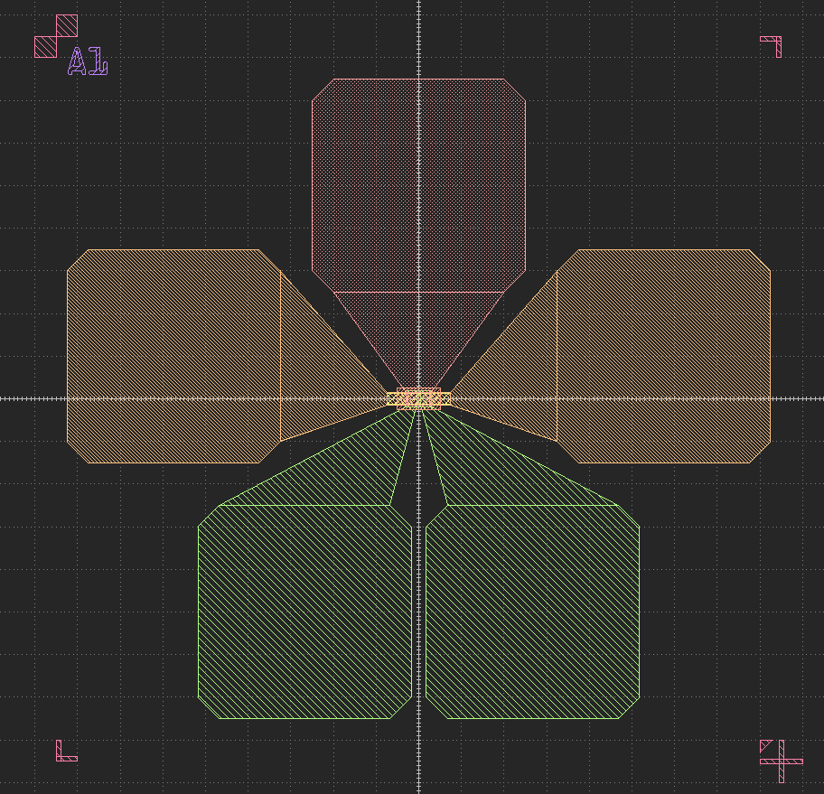
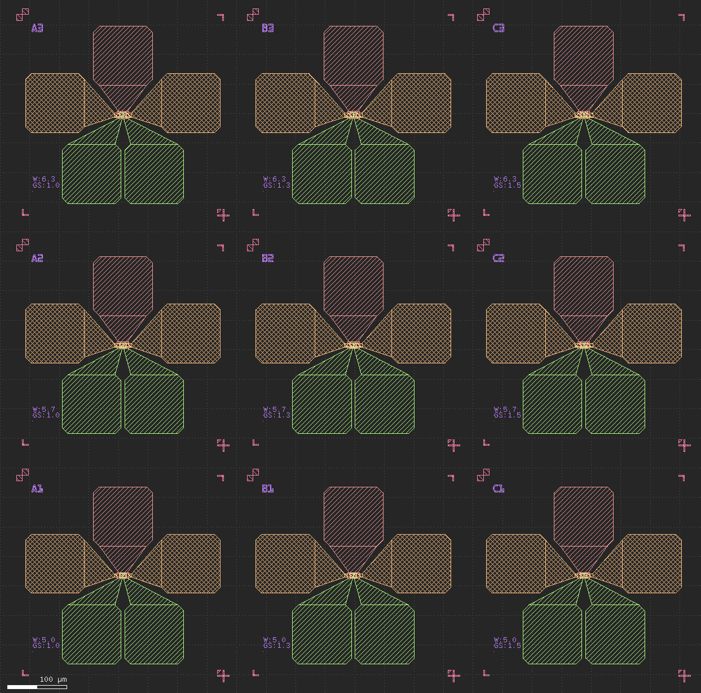
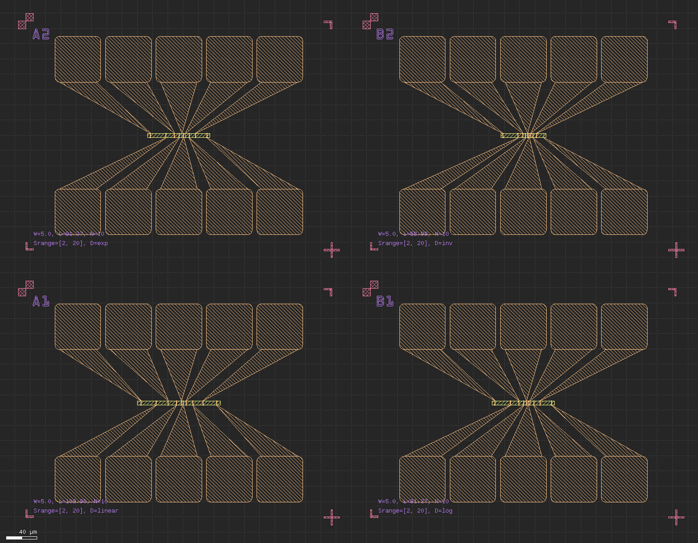

# KLayout Nanodevice Toolkit

<p align="center">
  <a href="docs/README_CN.md"><strong>中文文档</strong></a>
  ·
  <a href="docs/README_EN.md"><strong>English Mirror</strong></a>
</p>

<p align="center">
  
</p>

<p align="center">
  <strong>A KLayout-centered toolkit for semiconductor layout generation, reusable Python geometry modules, and grayscale pattern workflows.</strong>
</p>

<p align="center">
  <a href="https://www.python.org/downloads/"></a>
  <a href="https://www.klayout.de/"></a>
  <a href="LICENSE"></a>
</p>

## Why This Repo

This repository now focuses on the maintained KLayout toolkit and the reusable device-building modules underneath it.

- Parametric device generation for MOSFET, FET, Hall bar, TLM, meander, and electrode structures
- Maintained KLayout GUI, macro, and library workflow under `lymtoolkit/`
- Reusable Python utilities under `components/` and `utils/`
- Grayscale and image-driven pattern generation for nanofabrication workflows

The older root-level Python launcher files were removed to avoid maintaining a second, overlapping GUI and array-generator path.

## At A Glance

| Workflow | Entry Point | What It Does |
| --- | --- | --- |
| KLayout install | `lymtoolkit/install_lymtoolkit.bat` | Installs the toolkit GUI, runtime modules, and bundled resources into KLayout |
| KLayout GUI | `Tools -> NanoDevice -> NanoDevice GUI` | Opens the maintained interactive GUI after installation |
| PDK tooling | `lymtoolkit/PDK/` | Keeps technology files, layers, examples, and registration macros together |
| Python modules | `components/`, `utils/` | Reuse generators and helpers in custom scripts or lab automation |
| Grayscale patterns | `components/greyscale/` | Generates grayscale lithography assets and image-derived structures |

## Visual Preview

<p align="center">
  
  
  
</p>

## Quick Start

### 1. Create the environment

```bash
conda env create -f environment.yml
conda activate klayout-nanodevice-toolkit
pip install -r requirements.txt
```

### 2. Sanity-check the install

```bash
python --version
python -c "import klayout.db as kdb; print('klayout python api ready')"
python -c "from components.fet import FET; print('component import ready')"
```

### 3. Install the KLayout toolkit

```bash
.\lymtoolkit\install_lymtoolkit.bat
```

Then restart KLayout and open:

```text
Tools -> NanoDevice -> NanoDevice GUI
```

## Python Example

```python
from components.fet import FET

fet = FET(
    x=0,
    y=0,
    channel_width=5.0,
    channel_length=20.0,
    gate_overlap=2.0,
    device_label="FET_1",
)
fet.generate()
```

Generated GDS files are written to `output/`, and grayscale image outputs are written to `output/grayscaleImg/`.

## Repository Map

```text
KLayout_Nanodevice_Toolkit/
|-- components/                 Parametric device modules and grayscale generators
|-- docs/                       Supporting docs and language-specific entry pages
|-- lymtoolkit/                 KLayout macros, install scripts, toolkit integration, and PDK assets
|-- output/                     Generated layouts and image outputs
|-- utils/                      Geometry, fanout, labels, marks, QR, and helper utilities
|-- config.py                   Process, layer, font, and output-path configuration
|-- environment.yml             Conda environment definition
`-- requirements.txt            Pip dependencies
```

## Core Modules

### Device generators

- `components/mosfet.py`: dual-gate MOSFET layout generation
- `components/fet.py`: FET-focused parametric structures
- `components/hallbar.py`: Hall bar generators
- `components/tlm.py`: transfer-length-method structures
- `components/electrode.py`: electrode and pad geometries
- `components/meander.py`: meander-style routing or structures
- `components/resolution.py`: resolution-test patterns

### Utility layer

- `utils/geometry.py`: geometry primitives and shape operations
- `utils/fanout_utils.py`: fanout routing and pad-array helpers
- `utils/mark_utils.py`: alignment and registration marks
- `utils/text_utils.py`: layout text generation and placement
- `utils/QRcode_utils.py`: QR code generation for layout embedding
- `utils/alignment_utils.py`: overlay and alignment helpers

### KLayout integration

- `lymtoolkit/toolkit/nanodevice-toolkit/`: toolkit-facing KLayout macros and library registration
- `lymtoolkit/toolkit/nanodevice-pcell/`: PCell-oriented macro modules
- `lymtoolkit/PDK/`: technology definition, layer map, examples, and registration macro

## Recommended Reading

- [Chinese documentation](docs/README_CN.md)
- [Environment setup notes](docs/ENV_SETUP.md)
- [Quick start notes](docs/QUICK_START.md)
- [KLayout toolkit notes](lymtoolkit/README.md)

## Known Boundaries

- Some folders contain experimental or lab-specific templates alongside production utilities
- The maintained interactive GUI lives in the installed KLayout toolkit rather than the repository root
- KLayout-facing features require a working KLayout environment; pure Python utilities can still be reused offline

## License

MIT. See [LICENSE](LICENSE).
