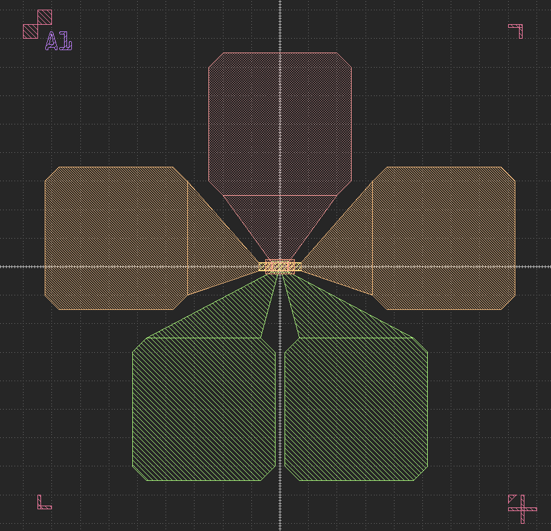

# KLayout 纳米器件版图工具包

[English README](README.md)

[](https://www.python.org/downloads/)
[](https://www.klayout.de/)
[](LICENSE)

<p align="center">
  
</p>

<h1 align="center">KLayout 纳米器件工具包</h1>
<p align="center">
  一个模块化、专业的 Python 工具包，用于在 KLayout 中快速生成半导体器件版图。
</p>

---

## 概述

KLayout 纳米器件工具包为参数化器件版图、自定义电极、高级扇出、对准标记等的生成提供了简洁、可扩展的框架。所有核心逻辑均以 Python 模块实现，便于自定义和脚本化，并通过 KLayout 宏（.lym）接口支持 GUI 工作流。

---

## 安装

1. **克隆仓库**
   ```bash
   git clone <your-repo-url>
   cd KLayout_Nanodevice_Toolkit
   ```

2. **安装 Python 依赖**
   ```bash
   pip install -r requirements.txt
   ```

3. **测试器件生成**
   - 可直接运行或修改 `components/` 目录下的脚本，或编写自己的脚本调用 `utils/` 中的函数。

---

## 工具函数概览（`utils/`）

- **geometry.py**：核心几何图元、形状操作、变换、布尔运算。
- **fanout_utils.py**：自动扇出布线、焊盘阵列生成、连接逻辑。
- **mark_utils.py**：对准、测量及自定义标记生成。
- **text_utils.py**：多语言文本标签渲染与布局。
- **digital_utils.py**：数字器件图案工具。
- **QRcode_utils.py**：二维码生成与版图嵌入。

---

## 器件组件（`components/`）

每个脚本生成一种典型器件结构。示例用法：

- **fet.py**：场效应管（FET）生成器
- **hallbar.py**：霍尔条（Hall bar）器件生成器
- **tlm.py**：转移长度法（TLM）结构生成器
- **electrode.py**：自定义电极与焊盘生成器
- **resolution.py**：分辨率测试图案

---

## 用法示例

### 1. 单个器件生成（Python API）

```python
from components.fet import FET

fet = FET(
    x=0, y=0,
    channel_width=5.0,
    channel_length=20.0,
    gate_overlap=2.0,
    device_label="FET_1"
)
fet.generate()
```

### 2. 参数扫描阵列生成（Python API）

```python
from layout_generator import LayoutGenerator

gen = LayoutGenerator()
gen.set_array_config(rows=3, cols=3, spacing_x=100, spacing_y=100)
gen.set_scan_config(
    channel_width_range=[2, 4, 6],
    channel_length_range=[10, 20, 30],
    scan_type='grid'
)
gen.generate_layout()
gen.save_layout("device_array.gds")
```

---

## KLayout 宏用法（`lymtoolkit/`）

### 1. 单个器件（GUI）

- 按上述方法安装宏。
- 在 KLayout 中，进入 **Tools → Macros → Run Macro...**，或使用已安装宏的菜单项（如 `fet_pcell` 或 `lymtoolkit/nanodevice-pcell/` 下的类似项）。
- 会弹出对话框，输入器件参数（如沟道宽度、长度、重叠、标签）。
- 点击 OK 即可在版图中放置器件。

<p align="center">
  
</p>
<p align="center"><em>示例：通过 lym 宏在 KLayout 中创建单个器件</em></p>

<p align="center">
  <table>
    <tr>
      <td align="center">
        
        <br/><em>FET 阵列</em>
      </td>
      <td align="center">
        
        <br/><em>HallBar 阵列</em>
      </td>
      <td align="center">
        
        <br/><em>TLM 阵列</em>
      </td>
    </tr>
  </table>
</p>
<p align="center"><em>典型纳米器件自动生成示例</em></p>

### 2. 参数扫描阵列（GUI）

- 在 KLayout 中，选择用于阵列/参数扫描的宏（如 `fanout_pcell` 或 `lymtoolkit/nanodevice-pcell/` 下的专用阵列宏）。
- 在对话框中输入阵列配置（行数、列数、间距）和参数扫描范围。
- 确认后自动生成完整器件阵列。

> **注意：** 如果上方图片无法显示，请将截图添加为 <code>lymtoolkit/example_single_device.png</code> 和 <code>lymtoolkit/example_array.png</code> 到仓库中。

> **说明：** .lym 宏为器件和阵列创建提供了用户友好的 GUI，内部调用与上述 API 示例相同的 Python 逻辑。若需高级自定义，请编辑或扩展 `components/` 和 `utils/` 目录下的 Python 模块。

---

## 许可证

MIT 许可证。详见 [LICENSE](LICENSE)。

---

基于 [KLayout](https://www.klayout.de/) 开发。致敬开源 EDA 社区。

---

如需英文文档，请参见 [English README](README.md)。 