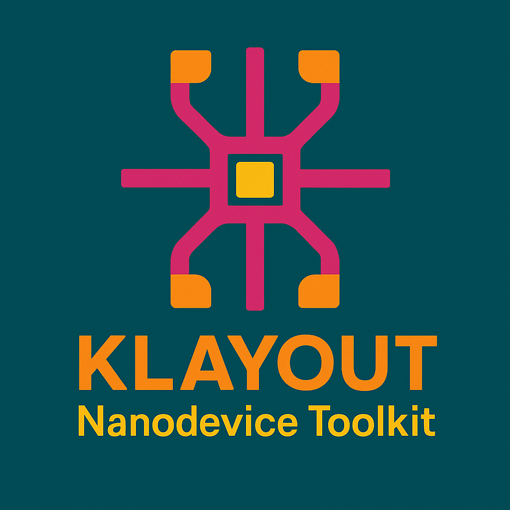

# KLayout Nano-device Layout Toolkit

[](https://www.python.org/downloads/)
[](https://www.klayout.de/)
[](LICENSE)

<p align="center">
  
</p>

<h1 align="center">KLayout Nanodevice Toolkit</h1>
<p align="center">
  A modular, professional Python toolkit for rapid semiconductor device layout generation in KLayout.
</p>

---

## Overview

KLayout Nanodevice Toolkit provides a clean, extensible framework for generating parameterized device layouts, custom electrodes, advanced fanout, alignment marks, and more. All core logic is implemented in Python modules for easy customization and scripting, with KLayout macro (.lym) interfaces for GUI-based workflows.

---

## Quick Start

### 1. Environment Setup

Create conda environment:
```bash
conda env create -f environment.yml
conda activate klayout-nanodevice-toolkit
```

> 💡 **Note**: If Python 11 is not available, modify `python=11` to `python=3.11` or `python=3.12` in `environment.yml`

### 2. Verify Installation

```python
python --version
python -c "import gdsfactory; print('gdsfactory installed')"
```

### 3. Install Python Dependencies

```bash
pip install -r requirements.txt
```

---

## Project Structure

```
KLayout_Nanodevice_Toolkit/
├── components/          # Device component modules
│   ├── fet.py          # FET device generator
│   ├── hallbar.py      # Hall bar device generator
│   ├── tlm.py          # TLM structure generator
│   ├── greyscale/      # Grayscale image generators
│   └── MyLayoutTemplate/  # Custom layout templates
├── utils/              # Utility function library
│   ├── geometry.py     # Geometric operations
│   ├── fanout_utils.py # Fanout routing
│   ├── mark_utils.py   # Alignment marks
│   ├── text_utils.py   # Text labels
│   └── ...
├── lymtoolkit/         # KLayout macro files
├── output/             # Output files directory
│   ├── *.gds          # GDS files
│   └── grayscaleImg/   # Grayscale images (BMP/PNG/TIFF)
├── config.py          # Global configuration
├── main.py            # Main program entry
└── environment.yml    # Conda environment configuration
```

---

## Core Features

### Utility Library (`utils/`)

- **geometry.py**: Core geometric primitives, shape operations, transformations, boolean ops
- **fanout_utils.py**: Automated fanout routing, pad array generation, connection logic
- **mark_utils.py**: Alignment, measurement, and custom mark generation
- **text_utils.py**: Multi-language text label rendering and placement
- **digital_utils.py**: Digital device pattern utilities
- **QRcode_utils.py**: QR code generation and layout embedding

### Device Components (`components/`)

- **fet.py**: Field-Effect Transistor (FET) generator
- **hallbar.py**: Hall bar device generator
- **tlm.py**: Transfer Length Method (TLM) structure generator
- **electrode.py**: Custom electrode and pad generator
- **resolution.py**: Resolution test patterns
- **greyscale/**: Grayscale image generators (for grayscale lithography)

---

## Usage Examples

### 1. Single Device Creation (Python API)

```python
from components.fet import FET

fet = FET(
    x=0, y=0,
    channel_width=5.0,
    channel_length=20.0,
    gate_overlap=2.0,
    device_label="FET_1"
)
fet.generate()
```

### 2. Parameter Scan Array Creation (Python API)

```python
from layout_generator import LayoutGenerator

gen = LayoutGenerator()
gen.set_array_config(rows=3, cols=3, spacing_x=100, spacing_y=100)
gen.set_scan_config(
    channel_width_range=[2, 4, 6],
    channel_length_range=[10, 20, 30],
    scan_type='grid'
)
gen.generate_layout()
gen.save_layout("device_array.gds")
```

### 3. Using GUI Interface

```python
from gui_interface import show_mosfet_layout_gui
show_mosfet_layout_gui()
```

### 4. KLayout Macro Usage

1. Install macros: Run `lymtoolkit/install_NanoDeviceToolkit.bat`
2. In KLayout: **Tools → Macros → Run Macro...**
3. Select the appropriate macro (e.g., `fet_pcell`) and enter parameters

---

## Output Files

All generated files are automatically saved to:

- **GDS files**: `output/*.gds`
- **Grayscale images**: `output/grayscaleImg/*.bmp`, `*.png`, `*.tif`

> 💡 **Note**: Output directories are created automatically, no manual creation needed

---

## Documentation

For more detailed information, see:

- [Environment Setup Guide](ENV_SETUP.md) - Detailed Conda environment configuration
- [Quick Start Guide](QUICK_START.md) - Three-step quick setup tutorial
- [Chinese README](../README.md) - 中文文档

---

## FAQ

### Q: Python 11 not found?
A: Python 11 may not be available in conda yet. Modify `python=11` to `python=3.11` in `environment.yml`.

### Q: How to ensure Cursor/VS Code uses the correct environment?
A: 
1. Press `Ctrl+Shift+P`
2. Type "Python: Select Interpreter"
3. Select `klayout-nanodevice-toolkit` environment

### Q: Where are output files?
A: All GDS files are saved in `output/` folder, grayscale images in `output/grayscaleImg/` folder.

---

## License

MIT License. See [LICENSE](../LICENSE) for details.

---

## Acknowledgments

Built on [KLayout](https://www.klayout.de/). Inspired by the open-source EDA community.

---

**中文**: 请参见 [中文 README](../README.md) 获取中文文档。
