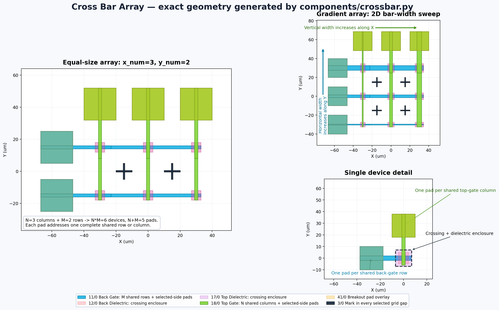

# NanoDevice Toolkit Library

This is a standalone KLayout library for NanoDevice GUI tools and NanoDevice FET structures.

The GUI includes a PDK-layered **Cross Bar Array** generator. It creates `N`
shared vertical top-gate columns (`18/0`) and `M` shared horizontal back-gate
rows (`11/0`). Their `N x M` intersections are the devices and require only
`N + M` external pads: one upper pad per column and one left pad per row. Bar
widths can be uniform or linearly graded, producing a two-dimensional width
sweep. Every crossing has back dielectric (`12/0`) and top dielectric (`17/0`)
with independent X/Y extensions beyond its actual overlap footprint. PDK
feature, line-spacing, pad-isolation, and dielectric-overlap checks are applied
before layout creation.

Cross-bar breakout geometry follows the same array conventions as the Sense /
Latch and Write / Read generators: square pads are duplicated onto the
conductor layer and the common pad layer (`41/0`), connections can use `line`
or `block` style, and pad size, overlap, row offset, and column offset are
independently adjustable. Horizontal-row pads can all be placed on either the
left or right, while vertical-column pads can all be placed on either the top
or bottom; every combination retains exactly `N + M` pads. Optional `R[i]` /
`C[i]` note labels and per-site grid outlines are also available. The mark is
placed in every blank interval bounded by four neighbouring crossings, giving
`(N - 1) x (M - 1)` marks rather than marks on devices. Cross, box-frame, diamond, circle,
triangle, L, and T mark types are supported. It defaults to `3/0` and has
independent size, line width, fine X/Y gap offset, and layer controls. A shared
interval-skip setting subsamples the gap grid in both directions: zero marks
every gap, one skips one gap after every mark, and so on.

The GUI includes a **Woodpile Cross Device** generator for one horizontal
back-gate bar crossing one vertical top-gate bar. Each bar connects through an
inner landing and trapezoidal fanout to its own outer probing pad. The two bars
are equal-width by default but can be sized independently. The material at the
crossing can be selected as n-type (`13/0`) or p-type (`14/0`); the back-gate
and top-gate structures use `11/0` and `18/0`, respectively. Both outer pads
default to square `80 x 80 um` pads without chamfered corners. Back-gate and
top-gate outer pads share synchronized length, width, chamfer type, and chamfer
size controls. Pad length is measured along each bar and pad width across it,
so rectangular pads rotate with their corresponding horizontal or vertical bar.

The GUI also includes a component-based **HEMT Device** generator. It supports
single-finger `S-G-D` and symmetric double-finger `S-G-D-G-S` layouts with
independent controls for gate length/width, source and drain access spacing,
ohmic dimensions, mesa margins, optional gate dielectric, and compact outer
gate/source/drain metal fields.

`Lsg` and `Lgd` may be zero. Independent Source-Gate and Gate-Drain overlap
parameters extend only the corresponding Gate edges while the Source and Drain
remain fixed. The resulting Gate length is `Lg + Osg + Ogd`; the signed edge
separations are `Lsg - Osg` and `Lgd - Ogd`, so zero spacing makes each
configured overlap equal its physical overlap directly.

For a single-finger device, gate pads are placed on both the left and right;
source and drain occupy the upper and lower fields. Their internal landing and
fanout are one complete trapezoid ending at a separate, solid rectangular outer
pad. Optional **Split Fine / Coarse EBL** mode moves core source/drain metal to
layer `26/0` and core gate metal to `28/0`; the large fanout and pads remain on
their corresponding `16/0` and `18/0` layers. In this mode only the fanout area
next to the inner contact is drawn as an open-ended fine-layer U: the inner
ohmic is the base and two adjustable-width sloped arms extend towards the
coarse fanout. `Fwid` is the shared line width for both Source and Drain inner
pad bases and all U arms. The double-finger centre Drain is a horizontal U that
opens towards its right-side coarse fanout; it is no longer a filled fine-layer
rectangle. U depth, line width, and fine/coarse overlap are independently
adjustable. The double-finger centre Drain and the gate transitions also
receive finite fine/coarse overlap. A
separate Gate Pad Retraction / Gap retracts only the right edge of the
left-side gate pad/manifold. The centre drain inner electrode and gate fingers
remain fixed.

HEMT alignment marks can be disabled, placed at the four device corners, or
placed at four corners plus the four side midpoints. Cross, box-frame, and
diamond marks are supported with adjustable size, line width, and independent
X/Y margins. Marks are written to the alignment-mark layer (`3/0`).

The **TLM** generator also supports optional split fine/coarse EBL exposure.
The channel-scale inner contacts and their fine leads are written to the
corresponding layer in the `21-29` stack (`15 -> 25`, `16 -> 26`), while the
square bridge pads immediately outside the channel, coarse fanout, and outer
probe pads remain on the original `11-19` metal layer. The bridge pads use an
adjustable, lithography-friendly edge gap and follow the selected two-row or
four-sided channel ring instead of following the widely distributed outer
pads. Each bridge contains an independently adjustable concentric fine-layer
square, and its fine route terminates at the square centre. Contact-to-bridge
connections use constant-width Manhattan routes with horizontal/vertical lane
assignment and overlap checks shared with the NanoRoute routing utilities.
Bridge-to-outer connections use a unified tangent construction: each square
bridge pad defines an inscribed circle, and the two ends of the probe pad's
inward edge connect to the corresponding envelope tangency points. The upper
and lower bridge rows support an adjustable outward V-step (`0,1,2,1,0` for
five pads), while the left/right outer pads align with the horizontal frame's
outer boundary. An optional negative bridge-centre mark reuses NanoMark's
diagonal-square, bonecross, split-bonecross (the EBL composite mark with a
checkerboard-like centre), or plain-cross geometry and is subtracted from the
coarse metal. For
larger electrode counts, both bridge and outer pads can switch automatically
from two rows to an isolated four-sided rectangular frame. The requested channel-to-bridge gap
is treated as a minimum and expands only when additional routing lanes are
required to avoid pad or route interference. All four spacing
distributions (`linear`, `log`, `exp`, and `inv`) work with centred or
left-to-right stepping in both lithography modes.

The active Mesa is centred on the requested device origin and sized from the
effective contact stack plus X/Y Mesa margins. Every gate finger extends past
both Mesa edges. `Gate Pad Edge = 0` tracks `Outer Metal Depth` automatically,
while a non-zero value overrides it. `Gate Control Margin` limits the effective
vertical contact edge so it remains narrower than the gate coverage.

`Mesa Width = 0` keeps the automatic contact-based Mesa width. A non-zero
value sets the centred Mesa width explicitly and may be smaller than `Gate
Width`, allowing the etched Mesa to define the effective channel width.
Changing `Mesa Width` does not pull the double-finger drain fanout into the
active core: the centre drain remains narrow until it clears the gate/Mesa
region. Upper and lower source structures remain mirror-symmetric about the
device centreline.

Included PCell:
- `NanoDeviceFETPCell`
- `MOSFETPCell`

The GUI keeps two separate MOSFET entries: `MOSFET` inserts the original
static component cell, while `MOSFET - PCell` inserts an editable PCell
instance with the same parameter form and preview.

Default layers:
- Channel: `14/0`
- Source/Drain: `16/0`
- Gate: `18/0`

Install:
1. Run `lymtoolkit\install_lymtoolkit.bat`
2. Restart KLayout
3. Open the `Libraries` panel
4. Use `NanoDeviceToolkitLib -> NanoDeviceFETPCell`
5. Or open the GUI tool from `Tools -> NanoDevice -> NanoDevice GUI`

GUI highlights:
- Extensible toolkit-style architecture
- Symbolic preview before insertion; expensive add-ons may opt into manual
  **Regenerate** mode with a compact Preparing/percentage/Ready indicator.
- Separate `Preview`, `Insert`, and `Symbols` actions
- Parameter symbols included for future schematic/annotation diagrams

Main adjustable parameters:
- Comb region size
- Finger width / spacing / count
- Channel length
- Top/bottom bus width
- Source and drain pad size / left-stacked placement
- Source and drain lead width
- Gate cover mode: `global` or `channel_only`
- Gate enclosure grow/shrink
- Gate pad size / position
- Gate lead width
